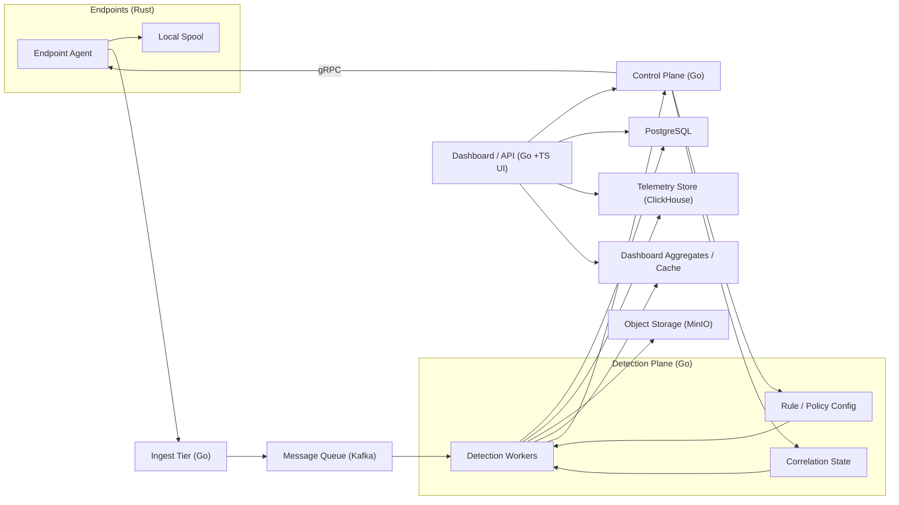

# Lavender
Lavender is a userspace EDR (Endpoint Detection and Response) tool built on a full Rust + Aya stack.

The project uses:
- `aya` in userspace (`agent`)
- `aya-ebpf` in kernel eBPF programs (`lavender-ebpf`)
- shared Rust event types in `common`

## Current Features
- `execve` tracepoint monitoring with process lineage tracking
- `sched_process_exit` tracepoint monitoring for process tree cleanup
- `openat` tracepoint monitoring for sensitive file-read detection
- `connect` tracepoint monitoring for outbound network connection events (IPv4 and IPv6)
- Per-process short-term correlation buffer (`max_events`, `max_age_secs`)
- Multi-step correlation rules (reverse-shell chain, cred-access then exec, rapid spawn)
- Context-aware scoring (base rule + lineage bonus + rare parent-child bonus + sequence bonus)
- Severity labels (`INFO`, `WARNING`, `HIGH`, `CRITICAL`) derived from total score
- Active response engine with `dry_run`, `kill_threshold`, and protected-process guards
- JSON event output stream on stdout and JSON alert stream on stderr
- Runtime filtering from `lavender.toml`

## Project Layout
- `agent`: Rust userspace loader (Aya) that loads/attaches probes and consumes ring buffers
- `lavender-ebpf`: Rust eBPF probes (Aya eBPF)
- `common`: shared Rust event structs used by both sides
- `lavender.toml`: runtime filtering config

## Architecture (Subject to Change)


## Prerequisites
- Linux kernel with BTF enabled (check if `/sys/kernel/btf/vmlinux` exists)
- Rust toolchain and `cargo`
- `rustup` with nightly toolchain
- nightly `rust-src` component
- `bpf-linker` installed in PATH
- sudo or root privileges to load/attach eBPF programs

Recommended setup:

```bash
rustup toolchain install nightly
rustup component add rust-src --toolchain nightly
cargo install bpf-linker
```

## Build
From repository root, build the userspace agent:

```bash
cargo build --package agent
```

During this build, `agent/build.rs` automatically builds `lavender-ebpf` for the BPF target with nightly and embeds the artifact path.

If you want to build only the eBPF crate directly:

```bash
cd lavender-ebpf
cargo +nightly build --target bpfel-unknown-none -Z build-std=core --release
```

## Tests
All current tests live under `agent/tests` as integration tests.

Run the full agent test suite from repository root:

```bash
cargo test -p agent --tests
```

Run all workspace tests:

```bash
cargo test --workspace
```

Current test files:
- `agent/tests/correlator_tests.rs`
- `agent/tests/detection_tests.rs`
- `agent/tests/runtime_state_tests.rs`
- `agent/tests/scorer_tests.rs`

## Run
From repository root:

```bash
cargo build --package agent
sudo ./target/debug/agent
```

Build as your normal user, then run the compiled binary with `sudo`.
Avoid running Cargo itself with `sudo`.

Or run only the binary directly after a prior build:

```bash
sudo ./target/debug/agent
```

On success, you should see:

```text
Lavender is watching. Ctrl+C to stop
```

## Configuration
Lavender configuration is documented in:

- [docs/CONFIGURATION.md](docs/CONFIGURATION.md)

That document covers:
- available keys in `lavender.toml`
- config loading order and defaults
- example config values
- running with explicit `LAVENDER_CONFIG`

## Save Output To JSON
Capture all normal events to `events.json` and alerts to `alerts.json`:

```bash
sudo ./target/debug/agent > events.json 2> alerts.json
```

The preferred runtime command is the compiled binary path:

```bash
sudo ./target/debug/agent
```

Capture only alerts to `alerts.json` (discard normal exec stream):

```bash
sudo ./target/debug/agent 1>/dev/null 2>alerts.json
```

Capture only alerts and also see them live in terminal:

```bash
sudo ./target/debug/agent 1>/dev/null 2> >(tee alerts.json >&2)
```

Note: the default Cargo output path for this package is `./target/debug/agent`.


## Why `exec format error` happens? (What I learned)
`lavender-ebpf` (the BPF target artifact) is an ELF object for the eBPF virtual machine, not a native userspace executable.

It cannot be run directly.
It must be loaded by the Rust userspace loader (`agent`) through Aya.

## Event Streams And Map Names
The userspace loader reads from four ring buffer maps:
- `EXEC_EVENTS`: process exec events (`pid`, `ppid`, `comm`, `filename`)
- `EXIT_EVENTS`: process exit events (`pid`)
- `OPEN_EVENTS`: file-open events (`pid`, `comm`, `filename`)
- `CONN_EVENTS`: network-connect events (`pid`, `comm`, `dest_ip`, `dest_port`, `af`)

Output JSON `type` values currently emitted:
- `exec`
- `conn`
- `alert`

Response events are emitted as JSON on stderr with `kind: "response"`.

Scored alerts also include optional score breakdown fields:
- `base_score`
- `lineage_bonus`
- `rarity_bonus`
- `sequence_bonus`

Alert rules currently emitted:
- `T1059 [Unexpected shell spawn]`
- `T1003 [Sensitive file read]`
- `T1071 [Connection to suspicious port]`
- `T1059 [Shell making outbound connection]`
- `T1071 [First time Network Caller]`
- `CHAIN Reverse shell behaviour`
- `CHAIN Credential access then execution`
- `CHAIN Rapid process spawning`

Current eBPF map/program names are defined in `lavender-ebpf/src/main.rs`.

## Development Notes
- Build with your normal user account, run the binary with `sudo`.
- A quick local verification loop is:

```bash
cargo test -p agent --tests
cargo build --package agent
sudo ./target/debug/agent
```

