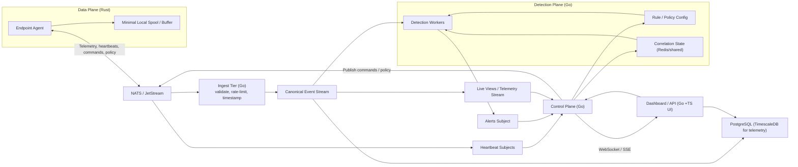

# Lavender
Lavender is an EDR prototype built around a Rust eBPF endpoint agent, a NATS transport layer, and small Go backend services for ingest and telemetry handling.

The repository currently contains two active paths:

- a local detection path inside the Rust `agent`
- a backend transport path where the agent publishes raw telemetry to NATS and `services/ingest` republishes canonical events

## Current Features
- eBPF tracepoints for `execve`, `sched_process_exit`, `openat`, and `connect`
- local JSON stdout/stderr output for exec events, connection events, alerts, and response actions
- local detection and correlation for shell spawn, sensitive file read, suspicious port, reverse-shell-style chains, and related scoring/response
- outbound NATS publishing for raw `exec` telemetry and `heartbeat` events
- Go ingest service that validates raw transport messages and republishes canonical telemetry
- Go telemetry-writer service that consumes canonical `exec` events
- runtime configuration via `lavender.toml`

## Project Layout
- `agent`: Rust userspace agent that loads probes, consumes ring buffers, runs local detections, and publishes transport events
- `lavender-ebpf`: Rust eBPF programs and ring buffer map definitions
- `common`: shared Rust event structs for the kernel/userspace boundary and transport schema
- `services/ingest`: Go service that validates raw transport events and republishes canonical telemetry
- `services/telemetry-writer`: Go service that consumes canonical telemetry and shapes exec rows
- `docs`: project documentation and implementation notes
- `docker`: local development container definitions

## Documentation
- [docs/CONFIGURATION.md](docs/CONFIGURATION.md)
- [docs/EVENT_STREAMS_AND_INTERFACES.md](docs/EVENT_STREAMS_AND_INTERFACES.md)
- [docs/ROADMAP.md](docs/ROADMAP.md)
- [docs/ARCHITECTURE_MIGRATION_PLAN.md](docs/ARCHITECTURE_MIGRATION_PLAN.md)
- [docker/compose/README.md](docker/compose/README.md)
- [docker/nats/README.md](docker/nats/README.md)

## Architecture (Subject to Change)


That diagram is the target direction. The current codebase only implements part of it: agent publishing, ingest canonicalization, and a telemetry-writer consumer. Detection workers, control-plane services, storage, and dashboard components are still planned work.

## Prerequisites
- Linux kernel with BTF enabled (`/sys/kernel/btf/vmlinux`)
- Rust toolchain and `cargo`
- `rustup` nightly toolchain with `rust-src`
- `bpf-linker` in `PATH`
- `sudo` or root privileges to attach eBPF programs

Recommended setup:

```bash
rustup toolchain install nightly
rustup component add rust-src --toolchain nightly
cargo install bpf-linker
```

## Build
Build the Rust agent from the repository root:

```bash
cargo build --package agent
```

`agent/build.rs` builds `lavender-ebpf` for the BPF target and embeds the artifact path into the userspace binary.

Build only the eBPF crate directly:

```bash
cd lavender-ebpf
cargo +nightly build --target bpfel-unknown-none -Z build-std=core --release
```

## Tests
Rust agent tests:

```bash
cargo test -p agent --tests
```

Workspace Rust tests:

```bash
cargo test --workspace
```

Go ingest tests:

```bash
cd services/ingest
go test ./...
```

Go telemetry-writer tests:

```bash
cd services/telemetry-writer
go test ./...
```

Containerized test workflow:

```bash
docker compose -f docker-compose.test.yaml up --build --abort-on-container-exit
```

Note: `docker-compose.test.yaml` currently runs the Rust agent tests and ingest tests, but not the telemetry-writer tests.

## Run
Build as your normal user:

```bash
cargo build --package agent
```

Then run the compiled binary with `sudo`:

```bash
sudo ./target/debug/agent
```

Avoid running Cargo itself with `sudo`.

On success, you should see:

```text
Lavender is watching. Ctrl+C to stop
```

## Local Broker And Stack
- broker-only workflow: [docker/nats/README.md](docker/nats/README.md)
- full local stack: [docker/compose/README.md](docker/compose/README.md)

## Configuration
Configuration reference:

- [docs/CONFIGURATION.md](docs/CONFIGURATION.md)

## Event Streams And Interfaces
Current stream names, transport subjects, JSON payload shapes, and eBPF map names are documented in:

- [docs/EVENT_STREAMS_AND_INTERFACES.md](docs/EVENT_STREAMS_AND_INTERFACES.md)

## Development Notes
- Build the agent as a normal user and run only the compiled binary with `sudo`.
- The agent still performs local detection and active-response decisions itself.
- The backend transport path currently publishes only `exec` and `heartbeat` events.
- `open`, `connect`, and `exit` events are still handled locally and are not yet emitted on the NATS transport path.
- For realistic host telemetry, run `nats` and `ingest` in Docker and run the Rust agent on the host against `nats://127.0.0.1:4222`.
- For quick end-to-end verification:

```bash
cargo test -p agent --tests
cargo build --package agent
docker compose up --build -d nats ingest telemetry-writer
sudo ./target/debug/agent
```

In another terminal, subscribe to the subject families you care about:

```bash
nats sub "telemetry.raw.>"
nats sub "telemetry.accepted.>"
nats sub "heartbeat.>"
```
