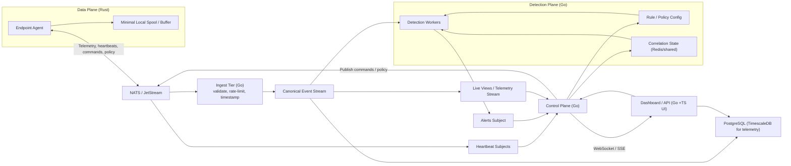

# Lavender
A distributed endpoint detection & response (EDR) system with Rust/eBPF agent, NATS JetStream transport, and horizontally-scalable stateless detection workers with externalized correlation state.

## Current Features
- eBPF tracepoints for `execve`, `sched_process_exit`, `openat`, and `connect`
- local JSON stdout/stderr output for exec events, connection events, alerts, and response actions
- local detection and correlation for shell spawn, sensitive file read, suspicious port, reverse-shell-style chains, and related scoring/response
- outbound JetStream publishing for `exec`, `open`, `connect`, and `exit` telemetry plus `heartbeat`, each carrying an agent-generated `event_id`
- durable, at-least-once backend pipeline over JetStream with message-id dedup
- Go ingest service that validates raw transport messages and republishes canonical telemetry
- Go telemetry-writer service that persists canonical `exec`, `open`, and `connect` events to TimescaleDB
- Go detection service that evaluates rules and correlation and emits alerts with a deterministic `alert_id`
- Go alert-writer service that persists alerts idempotently
- Go control-plane service exposing an alert list / lifecycle HTTP API
- runtime configuration via `lavender.toml`

## Project Layout
- `agent`: Rust userspace agent that loads probes, consumes ring buffers, runs local detections, and publishes transport events
- `lavender-ebpf`: Rust eBPF programs and ring buffer map definitions
- `common`: shared Rust event structs for the kernel/userspace boundary and transport schema
- `services/platform`: shared Go module — NATS/JetStream, Postgres, env, shutdown helpers, and the canonical event schema
- `services/ingest`: Go service that validates raw transport events and republishes canonical telemetry
- `services/telemetry-writer`: Go service that consumes canonical telemetry and writes telemetry rows
- `services/detection`: Go service that evaluates rules and correlation and emits alerts
- `services/alert-writer`: Go service that persists alerts to Postgres
- `services/control-plane`: Go service exposing the alert list and lifecycle HTTP API
- `docs`: project documentation and implementation notes
- `docker`: local development container definitions

## Documentation
- [docs/CONFIGURATION.md](docs/CONFIGURATION.md)
- [docs/EVENT_STREAMS_AND_INTERFACES.md](docs/EVENT_STREAMS_AND_INTERFACES.md)
- [docs/ROADMAP.md](docs/ROADMAP.md)
- [docs/ARCHITECTURE_MIGRATION_PLAN.md](docs/ARCHITECTURE_MIGRATION_PLAN.md)
- [docker/compose/README.md](docker/compose/README.md)
- [docker/nats/README.md](docker/nats/README.md)

## Architecture (Subject to Change)


That diagram is the target direction. The current codebase implements the agent publish path, ingest canonicalization, telemetry persistence, detection workers, alert persistence, and a control-plane alert API. Still planned: edge authentication (NATS auth + TLS), the command/response path back to the agent, heartbeat-driven host liveness, externalized correlation state, and the dashboard.

## Prerequisites
- Linux kernel with BTF enabled (`/sys/kernel/btf/vmlinux`)
- Rust toolchain and `cargo`
- `rustup` nightly toolchain with `rust-src`
- `bpf-linker` in `PATH`
- `sudo` or root privileges to attach eBPF programs

Recommended setup:

```bash
rustup toolchain install nightly
rustup component add rust-src --toolchain nightly
cargo install bpf-linker
```

## Build
Build the Rust agent from the repository root:

```bash
cargo build --package agent
```

`agent/build.rs` builds `lavender-ebpf` for the BPF target and embeds the artifact path into the userspace binary.

Build only the eBPF crate directly:

```bash
cd lavender-ebpf
cargo +nightly build --target bpfel-unknown-none -Z build-std=core --release
```

## Docker Build And Run
Build and run the full local stack from the repository root:

```bash
docker compose up --build
```

This builds and starts:

- `nats`
- `timescaledb`
- `ingest`
- `telemetry-writer`
- `detection`
- `alert-writer`
- `control-plane`
- `agent`

Host ports (`4222`, `8222`, `5432`, `8080`) are bound to `127.0.0.1` only, so the
stack is reachable from this host (nats CLI, host-run agent) but not from the
network. Edge authentication is still planned work.

Run it in the background:

```bash
docker compose up --build -d
```

Watch logs:

```bash
docker compose logs -f nats ingest telemetry-writer detection alert-writer control-plane agent
```

Stop the stack:

```bash
docker compose down
```

Start only the local NATS broker:

```bash
docker compose -f docker/nats/compose.yml up -d
```

Run the containerized test workflow:

```bash
docker compose -f docker-compose.test.yaml up --build --abort-on-container-exit
```

More detail is in [docker/compose/README.md](docker/compose/README.md) and [docker/nats/README.md](docker/nats/README.md).

## Tests
Rust agent tests:

```bash
cargo test -p agent --tests
```

Workspace Rust tests:

```bash
cargo test --workspace
```

Go ingest tests:

```bash
cd services/ingest
go test ./...
```

Go telemetry-writer tests:

```bash
cd services/telemetry-writer
go test ./...
```

Containerized test workflow:

```bash
docker compose -f docker-compose.test.yaml up --build --abort-on-container-exit
```

Note: `docker-compose.test.yaml` currently runs the Rust agent tests and ingest tests, but not the telemetry-writer tests.

## Run
Build as your normal user:

```bash
cargo build --package agent
```

Then run the compiled binary with `sudo`:

```bash
sudo ./target/debug/agent
```

Avoid running Cargo itself with `sudo`.

On success, you should see:

```text
Lavender is watching. Ctrl+C to stop
```

## Local Broker And Stack
- broker-only workflow: [docker/nats/README.md](docker/nats/README.md)
- full local stack: [docker/compose/README.md](docker/compose/README.md)

## Configuration
Configuration reference:

- [docs/CONFIGURATION.md](docs/CONFIGURATION.md)

## Event Streams And Interfaces
Current stream names, transport subjects, JSON payload shapes, and eBPF map names are documented in:

- [docs/EVENT_STREAMS_AND_INTERFACES.md](docs/EVENT_STREAMS_AND_INTERFACES.md)

## Development Notes
- Build the agent as a normal user and run only the compiled binary with `sudo`.
- The agent still performs local detection and active-response decisions itself, in addition to publishing telemetry to the backend.
- The backend transport path publishes `exec`, `open`, `connect`, and `exit` telemetry plus `heartbeat`. Nothing consumes heartbeats yet.
- For realistic host telemetry, run the backend in Docker and run the Rust agent on the host against `nats://127.0.0.1:4222`.
- For quick end-to-end verification:

```bash
cargo test -p agent --tests
cargo build --package agent
docker compose up --build -d nats timescaledb ingest telemetry-writer detection alert-writer
sudo ./target/debug/agent
```

In another terminal, subscribe to the subject families you care about:

```bash
nats sub "telemetry.raw.>"
nats sub "telemetry.accepted.>"
nats sub "alerts.>"
nats sub "heartbeat.>"
```

Inspect stored data:

```bash
docker exec lavender-timescale psql -U lavender -d lavender -c "SELECT rule, severity, event_comm FROM alerts ORDER BY id DESC LIMIT 10;"
```
